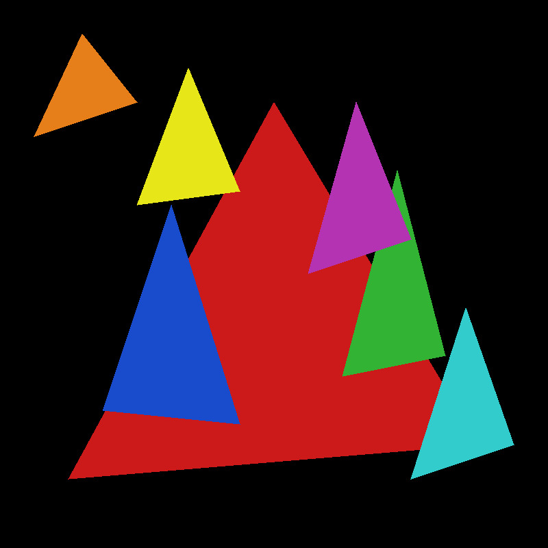

# C++ Software Rasterizer

A software rasterizer implemented in C++ that demonstrates fundamental computer graphics concepts including line drawing and triangle rasterization. The implementation uses the DDA algorithm for line drawing and scanline rasterization for triangle filling, handling all triangle types, including: flat-bottom, flat-top, and general case triangles.

## Features

- Line drawing using the Digital Differential Analyzer (DDA) algorithm
- Triangle rasterization using scanline filling
- Support for all triangle configurations through automatic splitting and specialized rendering paths
- Clean object-oriented architecture with separation of concerns
- PPM image output format

## Demo Output

The demo program generates an image showing multiple overlapping triangles in various colors, demonstrating the rasterizer's ability to handle different triangle types and orientations.



## Build

```bash
g++ -std=c++11 source/main.cpp source/ppm_image.cpp -o software-rasterizer_demo
```